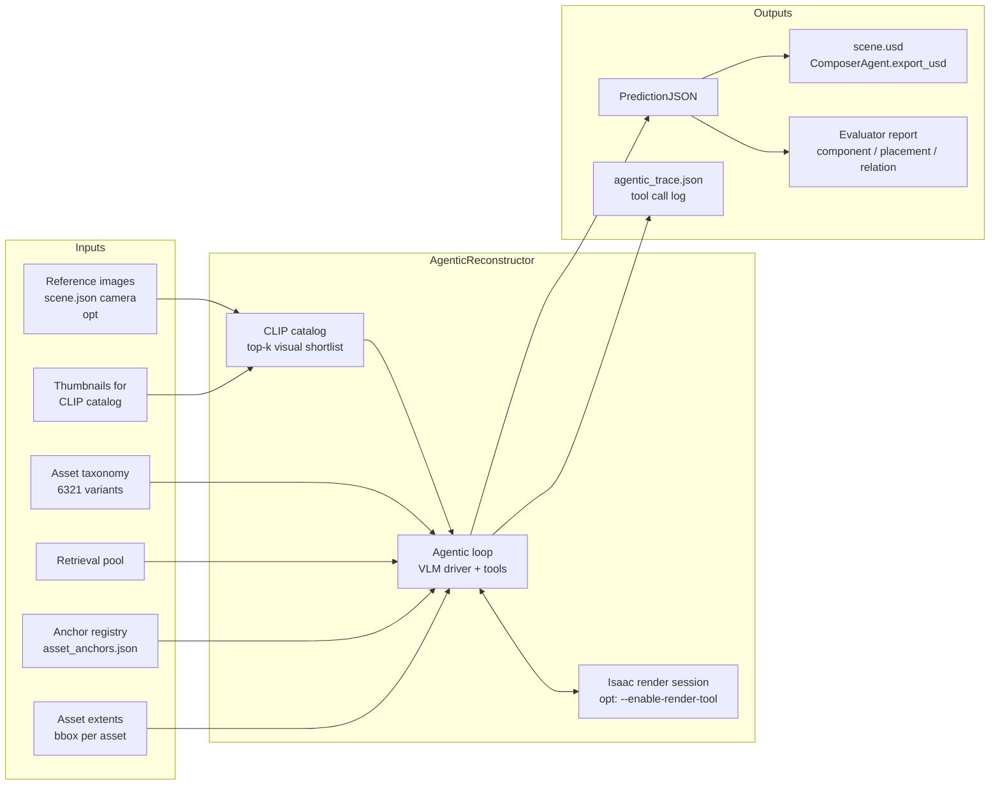
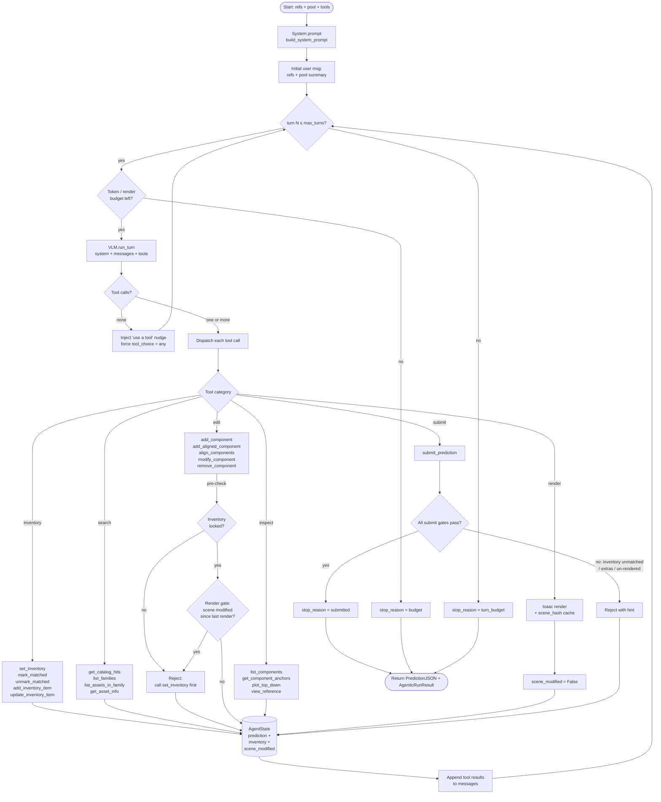

# Agentic Reconstructor — Architecture

Two Mermaid diagrams that together describe the agentic scene-reconstruction
loop in `src/isaacsim_bench/agents/`.

- **Figure 1 — System level.** Inputs the reconstructor consumes, the three
  internal components, and what comes out. Use this to set up the mental
  model in 30 seconds.
- **Figure 2 — Inside the loop.** What happens turn-by-turn inside the VLM
  driver: which tool categories the agent can call, what state they mutate,
  which gates block which transitions. Use this to discuss the
  inventory / render / submit gates — the load-bearing pieces of the
  current design.

Both render natively on GitHub. To export to PNG / SVG for slides:

```bash
npm i -g @mermaid-js/mermaid-cli
mmdc -i docs/agentic_architecture.md -o agentic_architecture.svg -t neutral
```

---

## Figure 1 — System level



**Source files**

| Block | File |
|---|---|
| AgenticReconstructor / loop driver | `src/isaacsim_bench/agents/agentic.py` |
| Tool handlers + AgentState | `src/isaacsim_bench/agents/agentic_tools.py` |
| Render tool (Isaac Sim bound) | `src/isaacsim_bench/agents/agentic_render.py` |
| CLIP catalog | `src/isaacsim_bench/agents/clip_catalog.py` |
| VLM provider abstraction | `src/isaacsim_bench/agents/vlm.py` |
| Anchor registry | `src/isaacsim_bench/schemas/anchors.py` |
| Asset extents | `data/asset_extents.json` |
| Evaluator | `src/isaacsim_bench/evaluator/` |

---

## Figure 2 — Inside the loop



### Gate hierarchy (the load-bearing rules)

1. **Inventory lock gate** — `add_component` / `modify_component` /
   `align_components` / `add_aligned_component` refuse to run until
   `set_inventory` has been called. Forces the agent to commit a
   structured count before any placement.
2. **Render-after-edit gate** — every scene edit must be followed by a
   `render` before the next edit, so the agent can attribute each change
   to a visible delta. Skipped when the render tool isn't wired in.
3. **Submit gates** (`submit_prediction`):
   - inventory locked + non-empty
   - render-after-edit clear (when render tool wired)
   - every inventory item has ≥1 matched component *or* is listed in
     `acknowledge_unmatched`
   - every placed component is matched to some inventory item *or* is
     listed in `acknowledge_extras` — catches under-counting where the
     agent treats a modular assembly as one item

### Why this shape

The fixed-pipeline reconstructor in `orchestrator.py` runs
`perception → retrieval → spatial → composer → critic` as a deterministic
chain. The agentic loop replaces that with a single VLM driver that
decides which tool to call next, iterating until it submits or hits a
budget. The structured inventory + gates exist because the unguarded
loop was happy to submit the first plausible scene and exit; the gates
force the agent to record an explicit count, place against it, and
account for every component before the loop can terminate.

---

## Suggested usages

| Audience / context | Use |
|---|---|
| 30-second elevator pitch | Figure 1 only |
| Progress meeting / writeup | Both figures |
| Slide deck | Figure 1 + a simplified Figure 2 (drop search / inspect branches) |
| Discussing a specific gate | Figure 2 + the gate hierarchy bullet list |
